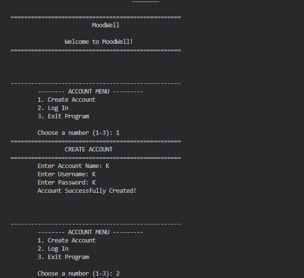
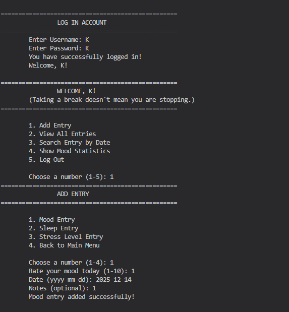
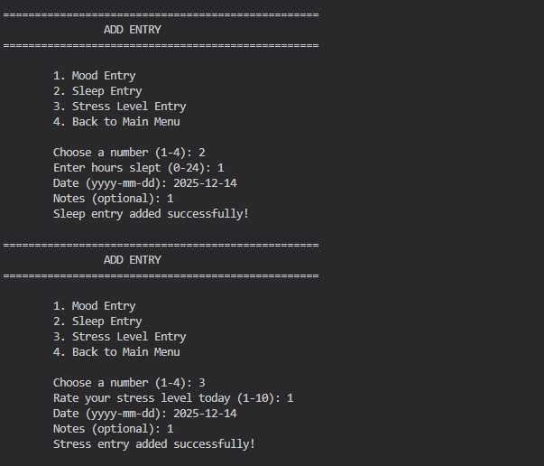
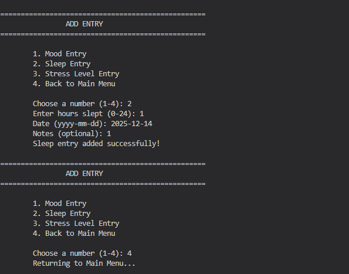
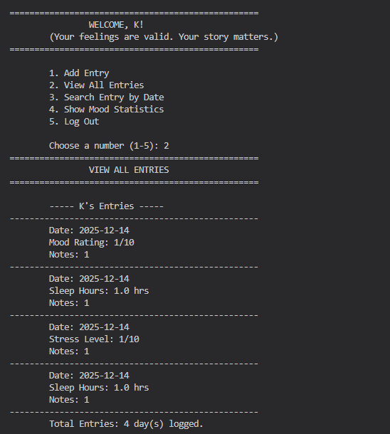
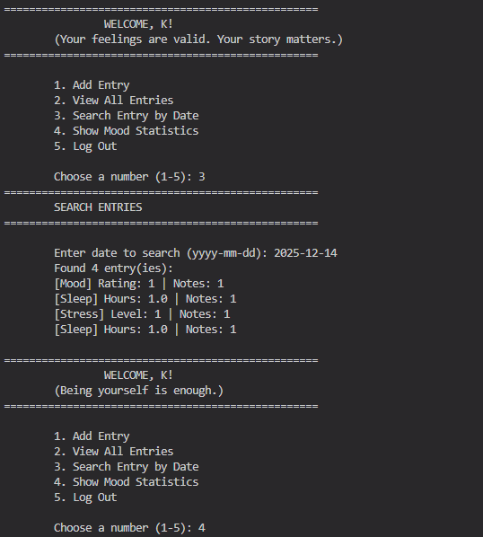
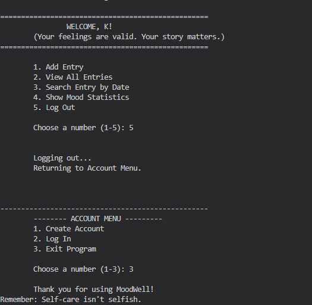

# MoodWell: A Console-Based Mental Health and Wellness Tracker

---

## 1. Project Title
**MoodWell: A Console-Based Mental Health and Wellness Tracker**

---

## 2. Description / Overview
MoodWell is a Java console-based application designed to help users monitor their daily mental and emotional well-being. It allows users to create an account, log in, record daily mood, sleep hours, and stress levels, and then view all entries or analyze mood statistics.

The main objectives of the MoodWell program are:
- To help the user monitor their mood, sleep, and stress levels  
- To encourage awareness of mental health patterns  
- To demonstrate proper implementation of OOP concepts in Java  
- To provide a simple, user-friendly console-based tracking system  

---

## 3. OOP Concepts Applied

### a. Encapsulation
Encapsulation protects user data and prevents unauthorized access. The `Account` class stores data such as username and password as private variables. Access is controlled using methods like `checkPassword()`, `addEntry()`, and `getEntries()`.

### b. Inheritance
Inheritance is used to avoid code repetition among different entry types. All entry types inherit common attributes such as `date` and `notes` from the abstract `Entry` class.

### c. Polymorphism
Polymorphism allows different entry objects to be treated as one parent type. When `displayEntry()` is called, Java automatically executes the correct method depending on whether the object is a `MoodEntry`, `SleepEntry`, or `StressEntry`.

### d. Abstraction
Abstraction is used through the abstract `Entry` class. Each subclass must implement its own version of `displayEntry()`.

### e. Try-Catch
Try-catch blocks are used to handle invalid numeric input from users. This prevents runtime crashes and ensures smooth program execution.

---

## 4. Program Structure

### Main Classes and Their Roles
- **MoodWell.java** – Launches the program and displays the welcome screen and account menu  
- **Account.java** – Manages account creation, login, and stores registered users  
- **User.java** – Stores individual user information and daily entries  
- **Entry.java (abstract)** – Base class for daily entries with date and notes  
- **MoodEntry.java** – Stores mood ratings  
- **SleepEntry.java** – Stores hours slept  
- **StressEntry.java** – Stores stress levels  
- **MainMenu.java** – Handles main user operations after login (add entries, view/search entries, view statistics)  

### Class Relationships
- A **User** has multiple **Entry** objects  
- **MoodEntry**, **SleepEntry**, and **StressEntry** inherit from **Entry**  
- **Account** manages multiple **User** objects  
- **MainMenu** operates on a **User** object once logged in  

---

## 5. How to Run the Program

1. Make sure you have **Java JDK (version 8 or above)** installed  
2. Install **Git** and an IDE (e.g., VS Code)  
3. Clone the repository from GitHub:
   ```
   git clone https://github.com/C-hynneA/MoodWell.git
   ```
4. Open the project folder in your IDE  
5. Open `MoodWell.java`  
6. Run the program  
7. Follow the on-screen prompts in the console  

---

## 6. Sample Output
When the program runs, the user is first shown an **Account Menu** in the console. After logging in, the **Main Menu** allows users to add entries, view entries, search records, and view statistics related to mood, sleep, and stress levels.















---

## 7. Author and Acknowledgement

### Authors
- Flores, Riana Gabriele M.  
- Hernandez, Kyla Mae D.  
- Vargas, Chynne Andrea B.  

### Acknowledgement
We would like to sincerely thank God for His constant guidance and presence throughout this semester. He has given us the strength, patience, and wisdom to overcome the challenges we faced while working on our Final Project. We are truly grateful for His blessings that have guided us from start to finish in this journey.

We also want to express our heartfelt gratitude to our instructor, Sir Juriel Comia, for sharing his knowledge, expertise, and valuable insights in programming, particularly in Java. Your patience, guidance, and encouragement have helped us improve our skills and understanding, and we are thankful for the time and effort you dedicated to teaching us.

We extend our special thanks to our Class Adviser, Ma’am Glydel Ann Reyes, for always being there for us. Your support, reminders, and advice have guided us in staying on track and motivated, and we are very grateful for your care and concern throughout the semester.

We would also like to thank our parents for their unwavering love, understanding, and support. Your encouragement, sacrifices, and belief in us have been our source of strength and motivation to keep moving forward and do our best in all our endeavors.

Lastly, we want to acknowledge our friends—Krizea Gabrielle, Kyla Marie, Leann Kirsten, Rhizel Kristine, Jouana Joy, and Joshua Vincent—for being with us every step of the way. Your laughter, encouragement, and support have made this semester more fun and bearable. Working on this project together has been a memorable experience because of you all.

To everyone who has guided, supported, and encouraged us, we sincerely thank you. This Final Project would not have been possible without your help, and we will always be grateful for your role in our journey.


---

## 8. Future Enhancements
- Persistent data storage using file handling or a lightweight database  
- Graphical User Interface (GUI) using JavaFX or Swing  
- Visual analytics using charts and graphs  
- Notifications and reminders for daily entries  
- Customizable motivational quotes and wellness tips  
- Export options for data (PDF or CSV)  
- Multi-user support with separate profiles  
- Mobile-friendly or web-based version
- Use a database for better storing of data or to actually save data inputs.

